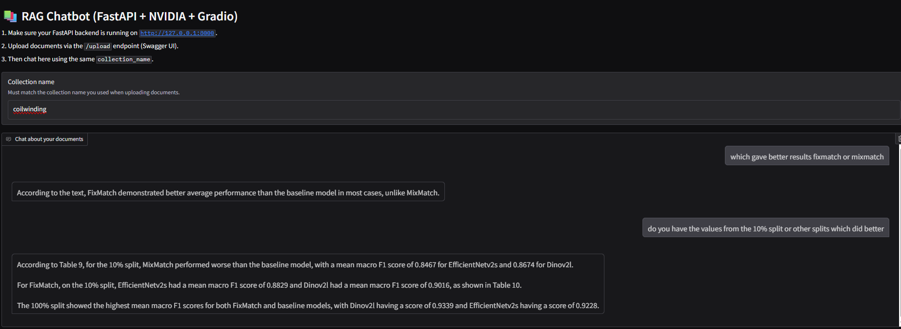

# Retrieval-Augmented Generation (RAG) Chatbot with FastAPI, NVIDIA LLMs, and Gradio


A Retrieval-Augmented Generation (RAG) chatbot that integrates FastAPI, Gradio, and NVIDIA NIM for intelligent document-based Q&A.
The system allows users to upload PDFs or HTML files, generates embeddings using MiniLM, stores them in a ChromaDB vector database, and performs LLM inference with conversational memory persisted via SQLite.

[](https://www.python.org/)
[](https://huggingface.co/models)
[](https://fastapi.tiangolo.com/)
[](https://swagger.io/)
[](https://www.example.com/langchain)
[](https://build.nvidia.com/)
[](https://www.gradio.app/)


## Getting Started
In this section, we'll guide you through setting up and running RAG for your document-based QnA. Follow these steps to get started:

### Prerequisites
Create a virtual python env in your local directory and activate it.
```bash
python3.9 -m venv venv/
source activate venv/bin/activate
```

### Installation 
1. Clone this repository to your local machine.
```bash
git clone https://github.com/devo002/RAG-chatbot-nvidia.git
cd rag_api
```
2. Install the required Python packages.
```bash
pip install -r requirements.txt
```


3. Create a free Nvidia account [NVIDIA NIM](https://build.nvidia.com/explore/discover) and get an api key copy the key into a created .env file

## Usage
We'll be using the [SwaggerUI](https://swagger.io/tools/swagger-ui/) (that comes bundled with the FastAPI library) to interact with our backend API. Through Swagger UI, you can:
1. Use the /upload endpoint to upload PDF or HTML documents.
2. Specify a collection name to organize and query your documents.

## Starting the server
To start the backend server

```bash
cd src
uvicorn rag_app.main:app --reload
```
### Opening SwaggerUI
In your favorite browser, go to the following link - 
```text
http://127.0.0.1:8000/docs
```
## Frontend
We also use the [Gradio](https://www.gradio.app/) interface to provide a simple and interactive frontend chatbot. It connects to the FastAPI /chat endpoint, enabling real-time, context-aware conversations over the uploaded documents.

In another terminal start the front end

``` 
cd rag_api
python gradio_app.py
```
Follow the link provided to start the gradio app and enter the same collection name as the backend and start your conversation.


An SQLite database is automatically created to store chat history and session data, ensuring conversations persist even if the server is restarted. This allows users to resume previous sessions seamlessly.

## Acknowledgements

This work builds upon and extends ideas from

 [rag_api](https://github.com/AshishSinha5/rag_api.git)